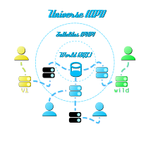

LiquidMS
========

SYNOPSIS
--------

- **php -S** *hostname*
- **php fetch.php** [*jobname*]
- **php liquidanacron.php**

SUMMARY
-------

*LiquidMS* is a clean room implementation of the Sonic Robo Blast 2 [HTTP
Master Server API][v1spec]. It can mirror netgame data from any API
Compatible master server, and due to the ability to synchronize with other
instances of itself, it is capable of being operated as a node within a
distributed master server network.

The project is licensed under the [GNU AFFERO GENERAL PUBLIC LICENSE Version 3][gnuaffero],
which is also accessible via the included `LICENSE.md` file
or the HTTP endpoint `/liquidms/license`.

Special thanks to GoldenTails whose reverse engineered HTTP master server
served as a reference to this project.  
<https://git.do.srb2.org/Golden/RevEngMS>

[v1spec]: <https://web.archive.org/web/20220205110841/https://mb.srb2.org/MS/tools/api/v1/>
[gnuaffero]: <https://www.gnu.org/licenses/agpl-3.0.en.html>

### External resources

- [SRB2Query] by James R. (exposed to the integrated server browser).

[SRB2Query]: <https://git.do.srb2.org/Golden/SRB2-Query>


FREQUENTLY ASKED QUESTIONS (FAQ)
--------------------------------

> So... I can host my own Master Server now?

Yes you can and much, much more.

> Do I need Docker (Compose) to run LiquidMS?

No. The Docker integration has been included to provide an easy way to host
an exemplary multi-node setup. All you need to host LiquidMS is a web
server, a MySQL/MariaDB database and a sufficiently configured PHP
environment. See `INSTALLATION` for more details.

> Do I need to forward ports/buy a server? 

Yes and no. If you simply want to snitch, all you need is an HTTP-capable
internet connection and a PHP environment to run `fetch.php` or
`liquidanacron.php`. If you decide to run a dedicated LiquidMS node
however, you will need to provide access to your server. Port
forwarding, registering domains and such will naturally be necessary.

> Why do you keep insisting to fetch-from-snitch?

[The original API][v1spec] was never designed with indirection or mirroring
in mind. As such LiquidMS can only supply tags to inform users of non-world
data. Should a node fetch from another node's v1 API, all information about
netgames' origins are substituted for the fetched v1 server, accumulating
tagged data in the mirrored database.


INSTALLATION
------------

First, download the source code and install all dependencies. You'll need
[PHP] 8.0.x, [Composer] and either [MariaDB] or [MySQL] with for this with
appropriate ODBC connectors and the following PHP extensions enabled:

- EXT_MBSTRING
- EXT_ODBC
- EXT_PDO
- EXT_SOCKETS (for hosting the server browser)
- EXT_YAML

If you have trouble installing PHP extensions, here's a few links for help,
depending on your operating system:

- [Windows](https://www.php.net/manual/en/install.pecl.windows.php)
- [Gentoo Linux](https://wiki.gentoo.org/wiki/PHP)
- [Arch Linux](https://wiki.archlinux.org/title/PHP)
- [Generic Linux](https://serverfault.com/questions/436634/installing-php-extensions-on-linux)

If you can't find yours, feel free to contribute whatever solution you
found. Additionally, if you're not sure whether your base PHP installation
already ships with a certain extensions, try running `php --modules`.

[Composer]: <https://getcomposer.org/doc/00-intro.md>
[MariaDB]: <https://mariadb.com/>
[MySQL]: <https://mysql.com/>
[PHP]: <https://www.php.net/>

```
$ git clone "https://github.com/zibonbadi/liquidms.git"
$ cd liquidms
liquidms$ composer install
```

LiquidMS requires a seperate SQL-capable relational database. As the
connection is established through an [ODBC] interface, this can be either
on-disk, on-system or remote.  All details about the preferred database
connection can be configured in the *environment file*; see
__CONFIGURATION__ for more info.

[ODBC]: <https://en.wikipedia.org/w/index.php?title=Open_Database_Connectivity&oldid=1044732966> "ODBC - Wikipedia"


### Host LiquidMS using Docker(-Compose)

You can easily run a working LiquidMS node as a set of Docker containers:

1. Navigate your terminal to this repository
2. Create the following files based on your customizations.
   For reference, use the provided `*.example` files:
   - `.env`
   - `fetch.config.yaml`
   - `fetch.crontab`,
   - `satellite.config.yaml
   - `tables.sql` 
3. Run `docker-compose build && docker-compose up`

### Basic database setup

Each running instance of a LiquidMS SRB2 master server is called a *node*.
Nodes may be run independently from their corresponding database and thus
may be used as read-only database mirrors in case you attempt to run a
distributed LiquidMS node network.

In order to set up your database (*world*), run `setup.sql` for a basic
setup and a modified version of `tables.sql.example` for your individual
configuration, like this:

```
user$ cat setup.sql tables.sql | isql liquidms
```

### Setting up ODBC on Unix-like systems (Linux, *BSD, macOS)

After installing your variant of unixODBC, you will need to define a
*driver* and *data source*. The driver defines the method of connection to
your database whereas the data source defines information about the server
and database you're trying to access. Below an exemplary MariaDB driver
(`/etc/odbcinst.ini` on Linux):

```INI
[MariaDB]
Description=MariaDB ODBC Connector
Driver=/usr/lib64/mariadb/libmaodbc.so
UsageCount=1
```

For data source definition, we recommend a configuration
(`/etc/odbc.ini` or `~/.odbc.ini` on Linux) like this:

```INI
[liquidms]
Description = LiquidMS database
Driver = <your driver>
Database = <your database ("liquidms" by default)>
Server = <your database server>
Port = <your database's server port>
Socket = /var/run/mysqld/mysqld.sock
User = <your SQL user>
Password = <your SQL password>
```

Once you're done setting up the configs, you can test unixODBC using
`iusql -v <your data source (e.g. "liquidms">`.
If you have trouble the [ArchWiki] has a helpful article on unixODBC.

[ArchWiki]: <https://wiki.archlinux.org/title/Open_Database_Connectivity>


USAGE
-----

### LiquidMS hosting model

The room *Universe* is defined as all servers stored within a LiquidMS
node's corresponding database, both internal and remote fetched.

The room *World* is defined as all servers uniquely registered to the
database and it's responses will be automatically generated by LiquidMS.
In order to host local rooms, one must register these in their database
manually with an ID between 2 and 99. This was a deliberate security
measure to avoid unauthorized remote database fiddling in distributed
setups. Room ID 1 is reserved for World and remains ignored.

All rooms with an id of 100+ will be reserved to be automatically generated
by LiquidMS depending on the origin and designated room of all remote
servers within it's database. These will be regularly deleted and rebuilt
so don't even attempt to set up a room in this range, it's not worth it.

When enabled, LiquidMS nodes also offer an integrated web-based server
browser over the route `/liquidms/browse`. This way players are able to
check for the status of netgames known to the LiquidMS node without need of
launching the game. This server browser can be altered or exchanged using
the config option `sbpath`, requiring an absolute path to the directory
containing the frontend. The exact structure required of a frontend to work
as a LiquidMS-compatible server browser will be displayed down below in YAML.

```YAML
sbpath:
- index.php # Entry point to your frontend.
- favicon.svg # Favicon
# More information on hooking your PHP scripts into LiquidMS in
# the "Views" section at <https://github.com/klein/klein.php>
- css/ # CSS data. Nested structure is permitted.
- img/ # Image stock. Nested structure is permitted.
- js/ # JavaScript resources. Nested structure is permitted.
- static/ # Static resources. Nested structure is permitted.
```

Currently LiquidMS ships with two server browsers by default,
only one of which can be hosted per satellite:

`dist/browser/fancy`
: An dynamic, modern server browser with the ability
  to query netgames right from within the UI.

`dist/browser/fast`
: A non-interactive, lightweight static browser faturing server-side
  rendering aimed at low usage of resources and bandwidth.

Furthermore the path `/liquidms/SRB2Query` offers live query information
about the state of the netgame, based on [SRB2Query] by James R.


### Hosting a LiquidMS node



LiquidMS is able to mirror server listings of any API-compliant SRB2 HTTP
V1 master server within it's own server database. This is called the
"superset mirror" concept and needs to be kept in mind when hosting a
LiquidMS node. Furthermore, to allow for load balanced network
architectures and maximum possible uptime, LiquidMS was designed with three
layers of operation in mind:

1. The ODBC Database or *World* at the core. Think of it as the model to
   LiquidMS, being responsible for managing all hosted data. For security,
   we deliberately left management of world rooms and banned servers to the
   database server administrator as to guarantee consistency across a
   LiquidMS network in terms of authorization and API I/O.
2. LiquidMS nodes, otherwise known as *sattelites* provide an HTTP API for
   supplying and managing the master server service. These nodes can also
   be used for fetching universe netgames into the ODBC database, although
   database access authorization is needed for operation. More on the
   concept of fetching down below.
3. *Universe servers* and *snitches* provide LiquidMS nodes and by
   extension the database with external universewide netgame data to be
   mirrored. More on the concept of snitching down below.

LiquidMS supports banning of servers through use of the database table
`bans`, consisting of the fields `host`, `subnetmask` and `expire`. As the
names suggest, it allows administrators to ban ranges of IPs based on
*subnet masks* rather than traditional numeric ranges. This allows for more
precise control of IP ranges through carefully crafted subnet masks at the
expense of subnet masks being restricted to sizes equal to a power of two.
The field `expire` contains a timestamp defining the expiration date and by
extension duration of the ban after which the entry will be automatically
removed from the database. The default value is the time of entry plus 24
hours. A timestamp of `NULL` defines a permanent ban.

**NOTE:** Due to missing functionality on behalf of MariaDB/MySQL, banning
is currently only implemented for singular IPs.

### Fetching

The script `fetch.php` parses server listings fetched from said master
servers defined in `config.yaml` and upserts them into it's defined ODBC
database.  For recurring execution, this script can be used either through
the supplied daemon script `liquidanacron.php` or independently as a
system-managed regular occurrence, such as a scheduled task on Windows or a
(ana)cronjob on POSIX. We recommend the latter for added flexibility.

To query individual servers, specify their job names as arguments to the
script like below. If unspecified, all servers will be fetched at once:

```sh
$ php fetch.php [jobname]
```

The script `liquidanarcon.php` serves as a simple daemon that regularly
engages in fetching/snitching of all specified universe servers. Acting
upon every minute, it logs timestamps of individual fetch queries and runs
them after the timespan defined in it's designated `minute` field has
passed. If no temporal data is specified for a job, it will be skipped.

For more information, see the *liquidanacron* section in __CONFIGURATION__.

```YAML
fetch:
  vanilla:
    host: "http://mb.srb2.org/0/MS"
    api: "v1" | "snitch"
    minute: 15
```

#### Fetch-from-snitch

The field `api` defines the API to be queried against during fetch
requests. `v1` signifies the default HTTP Master Server API, whereas
`snitch` is able to fetch servers from the Snitch API (see below).
It is recommended to use the Snitch API whenever possible to avoid possible
duplicates and network storms within a LiquidMS network; especially one
consisting of independent databases.


### Snitching

LiquidMS features a custom extension called the *Snitch API*. Through use
of the endpoint `/liquidms/snitch` via HTTP GET and POST requests,
independent hosts can contribute universe netgame mirrors to other LiquidMS
nodes without the need for database access authorization on behalf of the
peer, as it will automatically sanitize the supplied data based on it's
internal netgame hosting policy.

By supplying files of type `text/csv;header=absent` to a peer's
HTTP API, hosts can actively contribute to that peer's database. The CSV
data that is both supplied as well as expected by LiquidMS nodes is
defined by the following structure:

	<host>,<port>,<servername>,<version>,<roomname>,<origin>

To easily contribute data towards a peer ("snitching"), the configuration
file `config.yaml` defines the fields `fetchmode` with possible values of
`fetch` and `snitch` as well as the collection `snitch`. When set to
*fetch*, the fetch scripts `fetch.php` and `liquidanacron.php` will attempt
to provide automatically generated SQL queries to the configured ODBC
connection, as if these were to be used for a self hosted node setup. When
set to *snitch*, these scripts will instead attempt to supply their data to
all peers specified in the *snitch* collection of the configuration file.

```YAML
fetchmode: "fetch" | "snitch"
snitch:
  "http://localhost:8080"
  "http://my-fav-liquidms.node"
```


CONFIGURATION
-------------

All server configuration will be stored in the *config file*
`config.yaml`. For security, this Git repository will **not** include this
file within its commit history. Use the example file `config.yaml.example` for
reference as to what configuration options LiquidMS will accept. 

Also keep in mind that YAML is very sensitive about the indentation of
fields. Each indentation level is defined by *two whitespaces, not tabs*.
This shouldn't be too news to a regular GitHub user, but it's still noted
here for Linus-proofing.

```YAML
---
# This is an example config.yaml for a LiquidMS node environment
db: # LiquidMS DB connection settings
   dsn: "DRIVER=LiquidMS ODBC driver;SERVER=localhost" # ODBC DSN string.
   user: "alice"
   password: "password" # KEEP THIS SECRET!
fetch: # Master servers to leech off of
  vanilla:
    host: "http://mb.srb2.org/0/MS"
    minute: 15
  development:
    host: "http://localhost:8080"
    minute: 3
...
```

The attribute `dsn` stands for *Data Source Name*. It provides the ODBC system
with information about database and connection and its details may vary
depending on the database implementation. For a quick reference on how to write
DSN connection strings for most commonly used database implementations, we
recommend <https://www.connectionstrings.com/>. Otherwise we are not able to
take accountability for how you decide to run or connect to your database
using this interface; it is simply impossible for us to help you with that.


### MariaDB

As MariaDB currently remains our testing and design database (both due to
lack of database feature standardization as well as it's libre
software-induced ubiquity), here's a few tips on how to configure MariaDB
for a smooth, painless LiquidMS experience:

#### Enabling the event scheduler

LiquidMS relies on programmable database events to allow for live server
updates in a secure manner. In order to keep the necessary event scheduler
persistently enabled across reboots of the MariaDB daemon, add the
following line to your MariaDB config file (usually `my.cnf` or `my.ini`):

    event_scheduler=ON


### liquidanacron

Should you choose to use `liquidanacron.php` for your fetch queries, the
execution of master server queries will be determined by the field
`minute`. Much like anacron on POSIX systems, this script will keep track
of when a query has been executed last using timestamps documented in the
automatically generated file `timestamps.yaml` and automatically query a
master server once a specified amount of time has passed since last
execution.

Each number above 0 entered into a time field will be interpreted as a
multiplier to be understood as "every x minutes"; other values will equate
to 1. To ignore a specific temporal requirement, simply omit it's time
field from the job.


DEVELOPMENT
-----------

Simply Launch a server with PHP:

	$ php -S 127.0.0.1:8080 public/index.php

NOTE: The game has been reported to have difficulties around the local DNS
      name `localhost`. Also note that the URL must not end in a slash as
	  the game is not trailing slash-aware when doing HTTP requests.

Our `.gitignore` file also reserves a dedicated directory `local/` in case
you need to store information locally without committing them or fiddling
with resets or the `.gitignore`; config files and database setup scripts
for example.
